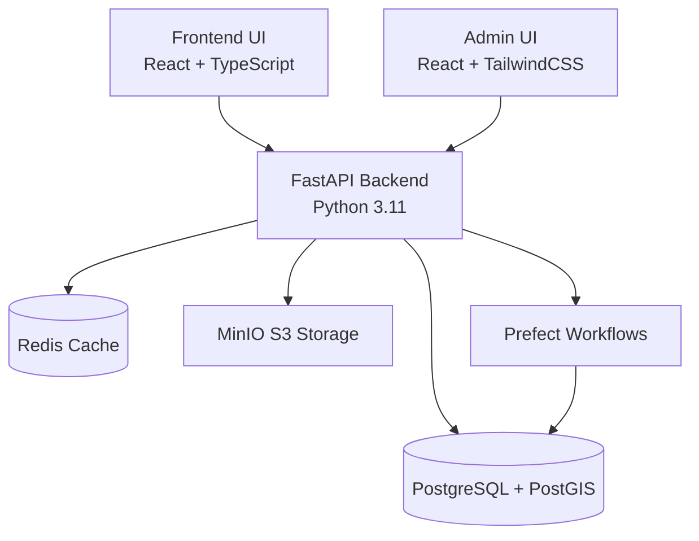

# Optimal Build - System Architecture

## 📐 Architecture Overview

> **Status legend** — ✅ Implemented · ⚙️ In Progress (partial) · 🔄 Planned / Upcoming

This document intentionally mixes shipped capabilities with near-term roadmap items to
provide a north-star reference. Each section below is tagged with its current delivery
status so readers can quickly distinguish today's behaviour from aspirational design.



## 🏗️ System Components

### Frontend Layer

#### **Building Compliance Frontend** (Port: 4400) — ✅ Implemented
- **Framework**: React 18.2 + TypeScript + Vite 4.5
- **UI Library**: Material-UI (MUI) 5.14
- **Mapping**: Mapbox GL 3.0
- **Charts**: Recharts 2.9
- **State Management**: React Context + Hooks
- **HTTP Client**: Axios 1.6
- **Testing**: Playwright (E2E), Node test runner (unit)

```
frontend/src/
├── api/              # API client layer
├── components/       # Reusable UI components
├── pages/            # Route-level pages
├── modules/          # Feature modules
├── hooks/            # Custom React hooks
├── services/         # Business logic
├── types/            # TypeScript definitions
├── i18n/             # Internationalization
└── router.tsx        # React Router config
```

#### **Admin UI** (Port: 4401) — ✅ Implemented
- **Framework**: React 18.2 + TypeScript + Vite 7.1
- **Styling**: TailwindCSS 3.3
- **PDF Rendering**: pdfjs-dist 5.4
- **Routing**: React Router DOM 6.21
- **Purpose**: Administrative dashboard, document management

### Backend Layer

#### **FastAPI Application** (Port: 9400) — ✅ Implemented
- **Framework**: FastAPI 0.104.1 + Uvicorn 0.24.0
- **Language**: Python 3.11
- **API Style**: RESTful + async/await
- **Documentation**: Auto-generated OpenAPI/Swagger

```
backend/app/
├── api/v1/           # REST API endpoints
│   ├── auth.py
│   ├── projects.py
│   ├── properties.py
│   ├── compliance.py
│   └── analytics.py
│
├── core/             # Core configuration
│   ├── config.py     # Settings management
│   ├── security.py   # Auth & permissions
│   ├── database.py   # DB connection pool
│   └── metrics.py    # Prometheus metrics
│
├── models/           # SQLAlchemy ORM models
│   ├── user.py
│   ├── project.py
│   ├── property.py
│   ├── market.py
│   └── compliance.py
│
├── schemas/          # Pydantic schemas (validation)
│   ├── user.py
│   ├── project.py
│   └── property.py
│
├── services/         # Business logic layer
│   ├── agents/       # AI & analytics agents
│   │   └── market_intelligence_analytics.py
│   ├── finance/      # Financial calculations
│   ├── buildable.py  # Buildability checks
│   ├── geocoding.py  # Location services
│   ├── compliance.py # Compliance checking
│   └── storage.py    # File storage
│
├── middleware/       # Request/response middleware
├── utils/            # Shared utilities
└── main.py           # Application entry point
```

- ✅ Current routers in production include `users_secure.py`, `projects_api.py`,
  `singapore_property_api.py`, `finance.py`, `entitlements.py`, `overlay.py`, and
  related per-domain modules under `backend/app/api/v1/`.
- 🔄 Consolidated endpoints (`analytics.py`, unified `compliance.py`) will arrive with the
  dedicated market intelligence API and compliance workflow refresh.

#### **Background Jobs & Workflows**
```
backend/
├── flows/            # Prefect workflows (⚙️ In Progress)
│   ├── adapters/
│   ├── normalize_rules.py
│   ├── parse_segment.py
│   ├── products.py
│   ├── sync_products.py
│   └── watch_fetch.py
│
├── jobs/             # Background job definitions (⚙️ In Progress)
│   ├── parse_cad.py
│   ├── overlay_run.py
│   └── generate_reports.py
│
└── scripts/          # CLI utilities (✅ Implemented)
    ├── seed_entitlements_sg.py
    ├── seed_finance_demo.py
    └── ingest.py
```

- ✅ Prefect refresh flows now include `compliance_flow.py` and `analytics_flow.py`
  for compliance snapshots and market intelligence reporting. Scheduled
  deployments remain on the roadmap to automate recurring runs.
- ⚙️ Upcoming enhancements: webhook notifications and MinIO lifecycle hooks for
  asynchronous exports and document cleanup.

### Data Layer

#### **PostgreSQL + PostGIS** (Port: 5432) — ✅ Implemented
- **Version**: PostgreSQL 15 with PostGIS 3.3
- **Purpose**: Primary data store with geospatial capabilities
- **ORM**: SQLAlchemy 2.0.23 (async)
- **Migrations**: Alembic

**Key Tables**:
- `users` - User authentication & management
- `projects` - Development projects
- `singapore_property` - Singapore-specific regulatory data
- `market_transactions` - Market data
- `yield_benchmarks` - Financial metrics
- `ai_agents` - AI agent configurations

See [DATA_MODELS_TREE.md](../DATA_MODELS_TREE.md) for complete schema.

#### **Redis** (Port: 6379) — ✅ Implemented
- **Version**: Redis 7-alpine
- **Use Cases**:
  - Session caching
  - Celery/RQ task queue
  - Rate limiting
  - Real-time data caching

#### **MinIO S3 Storage** (Port: 9000/9001) — ✅ Implemented
- **Purpose**: Object storage (S3-compatible)
- **Buckets**:
  - `cad-imports` - CAD file uploads
  - `cad-exports` - Generated exports
  - `documents` - PDF/document storage

### Orchestration & Processing

#### **Prefect** (Workflow Engine) — ⚙️ In Progress
- **Version**: 2.14.10
- **Purpose**: Background task orchestration
- **Workflows**:
  - ✅ Regulatory data ingestion (`sync_products`, `watch_fetch`, `normalize_rules`)
  - ⚙️ Compliance checking pipelines (prototype tasks under `backend/flows/`)
  - ⚙️ Market analytics processing (service ready, flow orchestration planned)
  - 🔄 Report generation (PDF bundling + delivery queue)

## 🔄 Data Flow

### 1. Compliance Check Flow — ✅ Implemented
```
User (Frontend)
  → POST /api/v1/singapore-property/check-compliance
    → FastAPI Handler
      → ComplianceService
        → Database Query (rules, regulations)
        → AI Agent Analysis
        → Response (violations, recommendations)
  ← JSON Response
```

### 2. Market Intelligence Flow — ✅ Implemented
```
User Request
  → MarketIntelligenceAnalytics.generate_market_report()
    → Parallel Analysis:
      ├─ Comparables Analysis (transactions)
      ├─ Supply Dynamics (pipeline)
      ├─ Yield Benchmarks (cap rates)
      ├─ Absorption Trends (velocity)
      └─ Market Cycle Position (indices)
    → Generate Recommendations
  ← MarketReport Object
```

> ⚙️ Scheduled automation remains on the roadmap — the `/api/v1/market-intelligence/report`
> endpoint now exposes real-time reports, with Prefect-driven refreshes planned to
> publish recurring updates.

### 3. File Upload & Processing Flow — ⚙️ In Progress
```
User Upload (CAD/PDF)
  → Frontend (multipart/form-data)
    → API /api/v1/uploads
      → MinIO Storage (store raw file)
        → Prefect Flow (async processing)
          ├─ Parse CAD/PDF
          ├─ Extract metadata
          ├─ Run compliance checks
          └─ Store results in PostgreSQL
        → Webhook notification
  ← Upload confirmation + job_id
```

> ⚙️ Current jobs handle CAD ingestion via `backend/jobs/parse_cad.py`; the fully
> automated Prefect pipeline, MinIO lifecycle hooks, and notification webhooks are
> planned enhancements.

## 🔐 Security Architecture

### Authentication & Authorization
- **Method**: JWT (JSON Web Tokens) via python-jose
- **Password Hashing**: bcrypt (passlib)
- **Token Storage**: HTTP-only cookies (frontend)
- **RBAC**: Role-based access control (admin/user/developer/consultant)

### API Security
- CORS middleware (configurable origins)
- Rate limiting (Redis-backed)
- Input validation (Pydantic schemas)
- SQL injection prevention (SQLAlchemy ORM)

## 📊 Monitoring & Observability

### Logging — ✅ Implemented
- **Library**: structlog 23.2.0
- **Format**: Structured JSON logs
- **Levels**: DEBUG, INFO, WARNING, ERROR, CRITICAL

### Metrics — ⚙️ In Progress
- **Library**: prometheus-client 0.19.0
- **Metrics**:
  - API request latency
  - Database query performance
  - Task queue length
  - Market intelligence indicators (⚙️ emitted once scheduled refresh metrics land)

## 🛠️ Tech Stack Summary

### Backend
| Component | Technology | Version |
|-----------|-----------|---------|
| Framework | FastAPI | 0.104.1 |
| Language | Python | 3.11 |
| Web Server | Uvicorn | 0.24.0 |
| Database ORM | SQLAlchemy | 2.0.23 |
| DB Driver | asyncpg | 0.29.0 |
| Migrations | Alembic | 1.13.0 |
| Validation | Pydantic | 2.5.0 |
| Task Queue | Prefect | 2.14.10 |
| Data Analysis | pandas, numpy, scikit-learn | Latest |
| Auth | python-jose, passlib | Latest |
| Storage Client | minio | 7.2.0 |
| Logging | structlog | 23.2.0 |

### Frontend
| Component | Technology | Version |
|-----------|-----------|---------|
| Framework | React | 18.2.0 |
| Language | TypeScript | 5.2.2 |
| Build Tool | Vite | 4.5.0 |
| UI Library | Material-UI | 5.14.17 |
| Mapping | Mapbox GL | 3.0.0 |
| Charts | Recharts | 2.9.0 |
| HTTP Client | Axios | 1.6.0 |
| E2E Testing | Playwright | 1.55.0 |

### Admin UI
| Component | Technology | Version |
|-----------|-----------|---------|
| Framework | React | 18.2.0 |
| Language | TypeScript | 5.3.2 |
| Build Tool | Vite | 7.1.7 |
| Styling | TailwindCSS | 3.3.5 |
| PDF Viewer | pdfjs-dist | 5.4.149 |
| Routing | React Router DOM | 6.21.1 |

### Infrastructure
| Component | Technology | Version |
|-----------|-----------|---------|
| Database | PostgreSQL + PostGIS | 15-3.3 |
| Cache | Redis | 7-alpine |
| Object Storage | MinIO | Latest |
| Container | Docker Compose | - |

## 🚀 Deployment Architecture

### Local Development (Docker Compose)
```
docker-compose.yml defines:
├── postgres (PostGIS 15-3.3-alpine)    :5432
├── redis (7-alpine)                    :6379
└── minio                               :9000/:9001

Managed by Makefile:
├── Backend (uvicorn)                   :9400
├── Frontend (vite dev)                 :4400
└── Admin UI (vite dev)                 :4401
```

### Development Workflow
```bash
# Start infrastructure
make dev          # Boots Docker + all services

# Verify services
make status       # Check PIDs

# Run tests
make test         # Backend pytest
make verify       # format + lint + pytest

# Stop services
make stop         # Stop processes
make down         # Stop Docker
make reset        # Rebuild + reseed
```

## 🗂️ Jurisdiction Support

### Singapore BCA (Building & Construction Authority) — ✅ Implemented
```
jurisdictions/sg_bca/
├── parsers/         # BCA regulation parsers
├── rules/           # Compliance rule definitions
├── tests/           # Jurisdiction-specific tests
└── README.md        # BCA integration docs
```

**Supported Features**:
- Plot ratio validation
- GFA (Gross Floor Area) calculations
- Building height restrictions
- Green Mark compliance
- Accessibility requirements

## 📈 Scalability Considerations

### Current Architecture Supports:
- **Horizontal scaling**: Stateless FastAPI instances behind load balancer
- **Database connection pooling**: AsyncIO + SQLAlchemy connection pool
- **Caching layer**: Redis for frequently accessed data
- **Async processing**: Prefect for long-running tasks
- **Object storage**: MinIO for file storage (S3-compatible)

### Future Enhancements:
- Message queue (RabbitMQ/Kafka) for event-driven architecture
- Read replicas for database scaling
- CDN for static asset delivery
- Kubernetes deployment for orchestration

## 📚 Related Documentation

- [Database Schema](../DATA_MODELS_TREE.md) - Complete data models
- [API Endpoints](../API_ENDPOINTS.md) - REST API reference
- [Frontend Documentation](frontend.md) - Frontend architecture
- [Finance API](finance_api.md) - Financial calculations API
- [Compliance Documentation](feasibility.md) - Compliance checking

---

*Last Updated: 2025-10-02*
*Architecture Version: 1.0*
