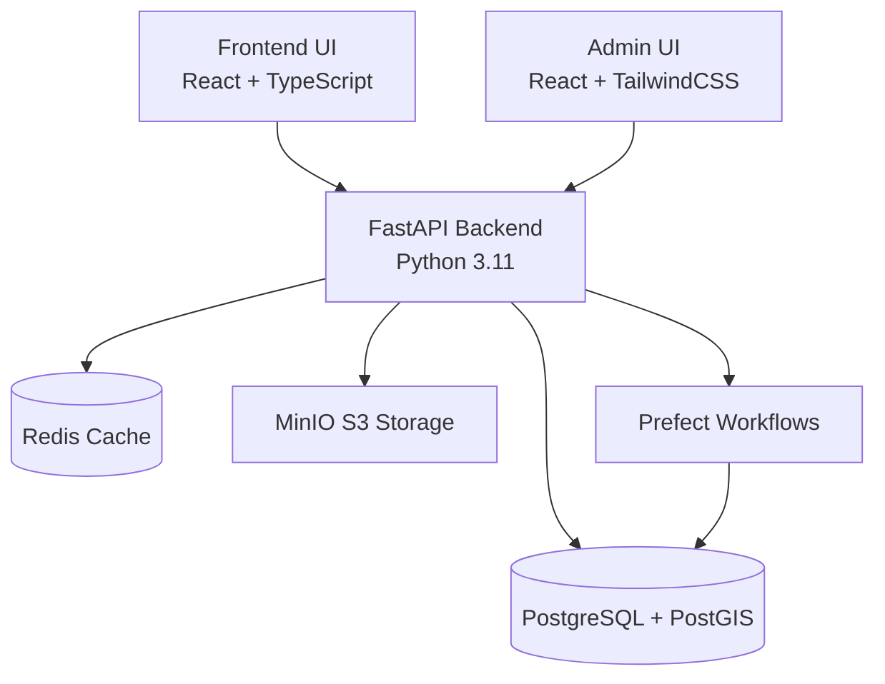

# Optimal Build - System Architecture

> **Single Source of Truth** — This document combines aspirational design with implementation reality. Each section uses status markers to show what's working vs. planned.

**Status Legend:**
- ✅ **Working** - Implemented and functional
- ⚙️ **Partial** - Partially implemented or incomplete
- ❌ **Missing** - Documented but not implemented
- 🔄 **Planned** - On roadmap

**Documentation Philosophy:** This document reflects both the product vision (north star) and actual implementation status. For detailed reality checks when documentation drifts from code, see [ARCHITECTURE_REALITY_CHECK.md](ARCHITECTURE_REALITY_CHECK.md).

**Last Updated:** 2025-11-11

---

## Table of Contents

1. [System Overview](#system-overview)
2. [System Components](#system-components)
   - [Frontend Layer](#frontend-layer)
   - [Backend Layer](#backend-layer)
   - [Data Layer](#data-layer)
   - [Orchestration & Processing](#orchestration--processing)
3. [Data Flow](#data-flow)
4. [Security Architecture](#security-architecture)
5. [Monitoring & Observability](#monitoring--observability)
6. [Package Ownership & Scaling](#package-ownership--scaling)
7. [Tech Stack](#tech-stack)
8. [Deployment](#deployment)
9. [Jurisdiction Support](#jurisdiction-support)
10. [Related Documentation](#related-documentation)

---

## System Overview



**Architecture Principles:**
- Async-first Python backend (FastAPI + SQLAlchemy async)
- Stateless API design for horizontal scaling
- PostgreSQL + PostGIS for geospatial capabilities
- Redis for caching and task queues
- MinIO for S3-compatible object storage
- Prefect for background job orchestration

---

## System Components

### Frontend Layer

#### Building Compliance Frontend (Port: 4400) — ✅ Working

**Tech Stack:**
- Framework: React 18.2 + TypeScript + Vite 4.5
- UI Library: Material-UI (MUI) 5.14
- Mapping: Mapbox GL 3.0
- Charts: Recharts 2.9
- State Management: React Context + Hooks
- HTTP Client: Axios 1.6
- Testing: Playwright (E2E), Vitest (unit)

**Structure:**
```
frontend/src/
├── api/              # API client layer
├── app/              # Application shell and routing
│   ├── layout/       # AppShell, AppNavigation
│   ├── pages/        # Route-level pages
│   └── components/   # Shared app components
├── modules/          # Feature modules
│   ├── cad/          # CAD workflows
│   ├── feasibility/  # Feasibility analysis
│   ├── finance/      # Financial modeling
│   └── deals/        # Business performance
├── hooks/            # Custom React hooks
├── services/         # Business logic
├── types/            # TypeScript definitions
├── i18n/             # Internationalization (en, ja)
└── router.tsx        # React Router config
```

**Reality Check:**
- ✅ Core navigation and routing working
- ✅ Finance workspace with sensitivity analysis
- ✅ Developer site acquisition with 3D preview viewer
- ✅ Business performance dashboard (Kanban, analytics)
- ⚙️ Frontend tests: 26 tests (16 passing, 10 with JSDOM timing issues)

#### Admin UI (Port: 4401) — ✅ Working

**Location:** `ui-admin/` (not `admin/`)

**Tech Stack:**
- Framework: React 18.2 + TypeScript + Vite 7.1.7
- Styling: TailwindCSS 3.3
- PDF Rendering: pdfjs-dist 5.4
- Routing: React Router DOM 6.21

**Structure:**
```
ui-admin/src/
├── components/       # Reusable components
├── pages/            # Document-centric pages
│   ├── DocumentsPage.tsx
│   ├── EntitlementsPage.tsx
│   ├── RulesReviewPage.tsx
│   ├── ClausesPage.tsx
│   ├── DiffsPage.tsx
│   └── SourcesPage.tsx
└── services/         # API clients
```

---

### Backend Layer

#### FastAPI Application (Port: 9400) — ⚙️ Partial

**API Endpoints** (`backend/app/api/v1/`)

✅ **Working Routers:**
```
Core:
├── users_secure.py       # Authentication & authorization
├── users_db.py           # User CRUD operations
├── projects_api.py       # Project management
├── singapore_property_api.py  # Singapore property data

Finance:
├── finance.py            # Financial calculations & scenarios
├── roi.py                # ROI calculations
├── costs.py              # Cost estimation

Developer Tools:
├── developers.py         # Developer workspace endpoints
│                         # (site acquisition, checklists, preview jobs)
├── deals.py              # Business performance pipeline
├── performance.py        # Agent performance analytics
├── listings.py           # Listing management

Compliance:
├── entitlements.py       # Entitlements/regulations
├── overlay.py            # Overlay processing
├── screen.py             # Screening workflows
├── ergonomics.py         # Ergonomics checks
├── standards.py          # Standards compliance
├── audit.py              # Audit trails

Data Management:
├── products.py           # Product catalog
├── imports.py            # Import workflows
├── export.py             # Export functionality
├── review.py             # Review workflows
├── rulesets.py           # Ruleset management

Intelligence:
└── advanced_intelligence.py # Investigation analytics stubs
```

📝 **Note:** No standalone auth.py, properties.py, or analytics.py as originally documented - functionality distributed across working routers.

**Core** (`backend/app/core/`)
```
✅ Implemented:
├── config.py           # Settings management (Pydantic BaseSettings)
├── database.py         # Async DB connection pool
├── jwt_auth.py         # JWT authentication
├── auth/               # Auth policies
│   └── policy.py
├── audit/              # Audit utilities
├── export/             # Export utilities
├── geometry/           # Geometry processing
├── overlay/            # Overlay processing
├── rules/              # Rules engine
└── models/             # Core model utilities

⚙️ Limited:
└── metrics/            # ROI metrics only (no Prometheus)
    └── roi.py

❌ Missing:
└── security.py         # Rate limiting, CORS hardening
```

**Models** (`backend/app/models/`)
```
✅ Core Models (20+ tables):
├── users.py              # User authentication & management
├── projects.py           # Development projects (70+ columns)
├── property.py           # Property data
├── singapore_property.py # Singapore-specific (ComplianceStatus enum)
├── preview.py            # Preview jobs (GLTF generation)

Market:
├── market.py             # YieldBenchmark, AbsorptionTracking,
│                         # MarketCycle, MarketIndex, CompetitiveSet,
│                         # MarketAlert

Finance:
├── finance.py            # FinScenario, FinResult, FinCapitalStack,
│                         # FinDrawdown, FinAssetBreakdown

Business Performance:
├── business_performance.py # AgentDeal, AgentDealStageEvent,
│                           # AgentDealContact, AgentDealDocument,
│                           # AgentCommissionRecord,
│                           # AgentPerformanceSnapshot,
│                           # PerformanceBenchmark

Other:
├── entitlements.py       # Entitlements
├── overlay.py            # Overlay data
├── rulesets.py           # Rulesets
├── imports.py            # Import tracking
├── audit.py              # Audit trails
├── ai_agents.py          # AI agent configurations
├── rkp.py                # RKP-specific
└── types.py              # Shared types

📝 Note: Naming convention inconsistent (some plural, some singular)
```

**Schemas** (`backend/app/schemas/`)
```
✅ 15+ schema files following domain structure:
├── user.py
├── project.py
├── property.py
├── market.py
├── finance.py
├── deals.py              # Business performance schemas
├── entitlements.py
├── audit.py
├── overlay.py
├── rulesets.py
└── ... (10 more)
```

**Services** (`backend/app/services/`)
```
✅ Core Services:
├── buildable.py          # Buildability checks
├── geocoding.py          # Location services (OneMap integration)
├── compliance.py         # Compliance checking
├── storage.py            # File storage abstraction
├── minio_service.py      # MinIO S3 client
├── preview_generator.py  # GLTF preview generation
├── preview_jobs.py       # Preview job lifecycle management

Domain Services:
├── alerts.py
├── ingestion.py
├── normalize.py
├── overlay_ingest.py
├── postgis.py
├── products.py
├── pwp.py
├── reference_parsers.py
├── reference_sources.py
├── reference_storage.py
├── standards.py
├── asset_mix.py          # Asset optimization engine
├── entitlements_sg.py    # Singapore entitlements

Finance:
└── finance/
    ├── calculator.py     # Finance calculations (NPV, IRR, DSCR)
    └── re_metrics.py     # Real estate metrics

Deals:
└── deals/
    ├── pipeline.py       # Agent deal pipeline
    ├── commission.py     # Commission ledger
    ├── performance.py    # Performance snapshots
    └── benchmark_ingest.py # Benchmark ingestion

Agents (11 AI agents - domain-specific):
└── agents/
    ├── market_intelligence_analytics.py  # Market analysis
    ├── development_potential_scanner.py  # Development potential
    ├── gps_property_logger.py            # GPS logging
    ├── investment_memorandum.py          # Investment docs
    ├── market_data_service.py            # Market data
    ├── marketing_materials.py            # Marketing generation
    ├── pdf_generator.py                  # PDF generation
    ├── photo_documentation.py            # Photo management
    ├── scenario_builder_3d.py            # 3D scenarios
    ├── universal_site_pack.py            # Site packs
    └── ura_integration.py                # URA integration
```

**Middleware** (`backend/app/middleware/`)
```
⚙️ Minimal:
└── security.py           # 2KB file with basic CORS

❌ Missing:
└── Rate limiting middleware (documented but not implemented)

📝 Note: CORS configured in main.py, not middleware/
```

**Background Jobs & Workflows**

**Prefect Flows** (`backend/flows/`) — ✅ Working
```
✅ Production flows:
├── compliance_flow.py      # Compliance snapshots (hourly scheduled)
├── analytics_flow.py       # Market intelligence (daily @ 3am UTC)
├── sync_products.py        # Regulatory data sync
├── watch_fetch.py          # Data watching
├── normalize_rules.py      # Rule normalization
├── parse_segment.py        # Segment parsing
├── products.py             # Product workflows
├── ergonomics.py           # Ergonomics workflows
├── deployments.py          # ✅ Scheduled deployments config
├── schedules.py            # Schedule definitions
└── _prefect_utils.py       # Utilities

📝 Note: Deployments configured via deployments.py for automated scheduling
```

**Background Jobs** (`backend/jobs/`) — ✅ Working
```
✅ Implemented:
├── parse_cad.py            # CAD file processing (35KB)
├── overlay_run.py          # Overlay processing
├── generate_reports.py     # Report generation + webhooks
├── raster_vector.py        # Raster/vector conversion (21KB)
├── notifications.py        # Webhook notifications
├── preview_generate.py     # Preview generation job handler
└── __init__.py

📝 Note: Webhook notifications in both notifications.py and generate_reports.py
```

**CLI Scripts** (`backend/scripts/`) — ✅ Working
```
✅ Seed Scripts:
├── seed_entitlements_sg.py   # Singapore entitlements
├── seed_finance_demo.py      # Finance demo data
├── seed_nonreg.py            # Non-regulatory data
├── seed_screening.py         # Screening data
├── seed_singapore_rules.py   # Singapore rules
├── run_smokes.py             # Smoke tests with artifacts

✅ Utilities:
├── aec_flow.py               # AEC flow runner
├── heritage/                 # Heritage overlay ingestion CLI
│   ├── fetch.py              # Download URA + NHB datasets
│   ├── transform.py          # Normalize + simplify geometries
│   ├── load.py               # Publish to backend/app/data/
│   └── __main__.py           # CLI entrypoint

❌ Missing from backend/scripts/:
└── ingest.py                 # Exists at top-level /scripts/ingest.py instead
```

---

### Data Layer

#### PostgreSQL + PostGIS (Port: 5432) — ✅ Working

**Version:** PostgreSQL 15 with PostGIS 3.3 (alpine)
**ORM:** SQLAlchemy 2.0.23 (async)
**Driver:** asyncpg 0.29.0
**Migrations:** Alembic 1.13.0 (25 migration files)

**Key Tables** (20+ tables documented):
```
Core:
├── users                    # User authentication & management
├── projects                 # Development projects (70+ columns)
├── properties               # Property data
├── singapore_property       # Singapore-specific regulatory data

Market:
├── yield_benchmarks         # Financial yield data
├── absorption_tracking      # Market absorption
├── market_cycle             # Market cycle data
├── market_index             # Market indices
├── competitive_set          # Competition data
├── market_alert             # Market alerts

Finance:
├── fin_scenarios            # Finance scenarios
├── fin_results              # Finance calculation results
├── fin_capital_stacks       # Capital stack configurations
├── fin_drawdowns            # Drawdown schedules
├── fin_asset_breakdowns     # Per-asset finance breakdowns

Business Performance:
├── agent_deals              # Deal pipeline
├── agent_deal_stage_events  # Stage transition history
├── agent_deal_contacts      # Deal contacts
├── agent_deal_documents     # Deal documents
├── agent_commission_records # Commission ledger
├── agent_commission_adjustments # Commission adjustments
├── agent_performance_snapshots # Performance metrics
├── performance_benchmarks   # Industry benchmarks

Preview:
├── preview_jobs             # 3D preview generation jobs

Other:
├── ai_agents                # AI agent configurations
├── audit_logs               # Audit trail with hash chaining
├── entitlements             # Singapore entitlements
└── overlays                 # Geospatial overlays
```

**See:** [architecture/data-models.md](architecture/data-models.md) for complete schema reference.

#### Redis (Port: 6379) — ✅ Working

**Version:** Redis 7-alpine

**Use Cases:**
- ✅ Celery/RQ task queue
- ✅ Session caching
- ❌ Rate limiting (documented but not implemented)
- ⚙️ Real-time data caching (partial)

#### MinIO S3 Storage (Ports: 9000/9001) — ✅ Working

**Purpose:** S3-compatible object storage

**Configured Buckets:**
- `cad-imports` ✅
- `cad-exports` ✅
- `documents` ⚙️ (mentioned in docs but not in docker-compose.yml)

**Features:**
- ⚙️ Lifecycle management (optional via `STORAGE_RETENTION_DAYS`)
- ✅ Webhook notifications (in generate_reports.py)

**Static Assets:**
- `static/dev-previews/` - GLTF preview assets (local filesystem)

---

### Orchestration & Processing

#### Prefect (Workflow Engine) — ⚙️ In Progress

**Version:** 2.14.10

**Purpose:** Background task orchestration

**Workflows:**
- ✅ Regulatory data ingestion (`sync_products`, `watch_fetch`, `normalize_rules`)
- ✅ Compliance checking pipeline (`compliance_flow.refresh_singapore_compliance`)
- ✅ Market analytics processing (`analytics_flow.refresh_market_intelligence`)
- ⚙️ Report generation (PDF bundling + delivery queue)

**Deployments:** `backend/flows/deployments.py` builds default Prefect deployments:
- Market intelligence: Daily @ 3am UTC
- Compliance: Hourly refresh

---

## Data Flow

### 1. Compliance Check Flow — ✅ Implemented
```
User (Frontend)
  → POST /api/v1/singapore-property/check-compliance
    → FastAPI Handler
      → ComplianceService
        → Database Query (rules, regulations)
        → AI Agent Analysis
        → Response (violations, recommendations)
  ← JSON Response
```

### 2. Market Intelligence Flow — ✅ Implemented
```
User Request
  → MarketIntelligenceAnalytics.generate_market_report()
    → Parallel Analysis:
      ├─ Comparables Analysis (transactions)
      ├─ Supply Dynamics (pipeline)
      ├─ Yield Benchmarks (cap rates)
      ├─ Absorption Trends (velocity)
      └─ Market Cycle Position (indices)
    → Generate Recommendations
  ← MarketReport Object
```

> ⚙️ Scheduled automation remains on roadmap - `/api/v1/market-intelligence/report` endpoint exposes real-time reports, with Prefect-driven refreshes planned for recurring updates.

### 3. File Upload & Processing Flow — ⚙️ In Progress
```
User Upload (CAD/PDF)
  → Frontend (multipart/form-data)
    → API /api/v1/uploads
      → MinIO Storage (store raw file)
        → Prefect Flow (async processing)
          ├─ Parse CAD/PDF
          ├─ Extract metadata
          ├─ Run compliance checks
          └─ Store results in PostgreSQL
        → Webhook notification
  ← Upload confirmation + job_id
```

> ⚙️ CAD ingestion handled by `backend/jobs/parse_cad.py`; reporting bundle job (`backend/jobs/generate_reports.py`) persists analytics exports and emits optional webhooks. Remaining work: notification fan-out and MinIO lifecycle automation in production.

### 4. Preview Generation Flow — ✅ Implemented
```
User (Developer Site Acquisition)
  → POST /api/v1/developers/properties/log-gps
    → Capture Property + Enqueue Preview Job
      → Job Queue (inline or RQ)
        → preview_generate.py
          → preview_generator.py
            ├─ Generate GLTF geometry
            ├─ Generate preview.bin (binary data)
            ├─ Generate preview.json (metadata)
            └─ Generate thumbnail.png (Pillow)
        → Update PreviewJob (status=READY, metadata_url)
  ← Preview Job ID + Asset URLs
```

**Status Transitions:**
- Inline backend (dev): QUEUED → READY (<1s, synchronous)
- RQ backend (prod): QUEUED → PROCESSING → READY (2-10s, async)

---

## Security Architecture

### Authentication & Authorization — ⚙️ Partial

**Method:** JWT (JSON Web Tokens) via python-jose
**Password Hashing:** bcrypt (passlib)
**Token Storage:** ⚙️ Documented as HTTP-only cookies (not verified in code)
**RBAC:** ⚙️ Roles mentioned (admin/user/developer/consultant) but not fully verified
**Auth Logic:** Split across `users_secure.py`, `users_db.py`, `core/jwt_auth.py`, `core/auth/policy.py`

**Token Expiry:**
- Access token: 24 hours
- Refresh token: 7 days

### API Security

- **CORS:** ✅ Configured in main.py
- **Rate Limiting:** ❌ Documented but **not implemented** in middleware
- **Input Validation:** ✅ Pydantic schemas
- **SQL Injection Prevention:** ✅ SQLAlchemy ORM

---

## Monitoring & Observability

### Logging — ✅ Working

- **Library:** structlog 23.2.0
- **Format:** Structured JSON logs
- **Levels:** DEBUG, INFO, WARNING, ERROR, CRITICAL
- **Location:** `backend/app/utils/logging.py`

### Metrics — ❌ Not Implemented

- **Library:** prometheus-client 0.19.0 (installed but **not instrumented**)
- **Documented Metrics** (all missing):
  - ❌ API request latency
  - ❌ Database query performance
  - ❌ Task queue length
  - ❌ Market intelligence indicators

📝 **Note:** `backend/app/core/metrics/` exists but only contains `roi.py` (ROI calculations, not Prometheus metrics)

---

## Package Ownership & Scaling

### High-Level Package Map

| Package / Path | Primary Responsibility | Notes |
| --- | --- | --- |
| `backend/app/api` | FastAPI routers and request/response schemas | Thin transport layer – pushes work into services/jobs |
| `backend/app/services` | Domain logic (feasibility, finance, overlays, ingestion, storage) | Each subpackage mirrors a user-facing capability |
| `backend/app/flows` & `backend/app/jobs_registry.py` | Prefect flows / async background orchestration | Orchestrates long-running tasks (preview renders, imports) |
| `backend/app/models` | SQLAlchemy models + Alembic migrations | Shared declarative base (`BaseModel`) and metadata helpers |
| `backend/app/utils` | Cross-cutting helpers (metrics, logging, Singapore compliance) | High change velocity |
| `frontend/` | React/Vite site acquisition + developer workspace | Talks to `/api/v1/*` and preview jobs |
| `docs/` | Product & engineering runbooks | Keep current with code changes |

### Known Hot Spots and Scaling Risks

| Area | Risk at 10× | Risk at 100× | Mitigation / Next Steps |
| --- | --- | --- | --- |
| API request throughput | Rate limiting 10 rpm (default); need asyncio worker tuning + horizontal scaling | Requires load balancing + autoscaling | Benchmark with Locust/ab before Phase 2D |
| Preview rendering queue | Prefect workers use in-memory SQLite; at 10× jobs queue latency spikes | Needs dedicated task runner + Postgres/Redis backend | Migrate Prefect storage to Postgres/Redis |
| Heritage overlay ingestion | Long-running GeoPandas ops in-process; at 10× polygon count risk timeouts | Requires batching + caching, async workers | Add spatial indexing + caching; profile with larger dataset |
| Finance calculators | Heavy NumPy/StatsModels usage; CPU-bound | Needs vectorised caching or async job offload | Extend regression tests & benchmark; consider Numba |
| Utils metrics/logging | Sparse coverage; risk of silent failures | Needs full instrumentation + Prometheus exporter | Expand tests + structured logging |

### Import Graph & Dependencies

**See:** `docs/architecture/import_graph.dot` for full module dependency graph (generated via pydeps).

**Hot Cross-Package Edges:**
- `backend/app/api` → `backend/app/services/*`
- `backend/app/services/*` → `backend/app/models`, `backend/app/utils`, `backend/app/jobs_registry`
- `backend/app/services/finance` → `backend/app/utils/metrics`, external `numpy/pandas`
- `backend/app/services/heritage_overlay` → `backend/app/utils/singapore_compliance`
- `backend/app/services/preview_jobs` ↔ `backend/app/jobs_registry`

**No circular imports detected.** If new circular references appear, record in [Unified Execution Backlog](all_steps_to_product_completion.md#-unified-execution-backlog--deferred-work) with owners and remediation tasks.

---

## Tech Stack

### Backend

| Component | Technology | Version | Status |
|-----------|-----------|---------|--------|
| Framework | FastAPI | 0.104.1 | ✅ |
| Language | Python | 3.11 | ✅ |
| Web Server | Uvicorn | 0.24.0 | ✅ |
| Database ORM | SQLAlchemy | 2.0.23 | ✅ |
| DB Driver | asyncpg | 0.29.0 | ✅ |
| Migrations | Alembic | 1.13.0 | ✅ |
| Validation | Pydantic | 2.5.0 | ✅ |
| Task Queue | Prefect | 2.14.10 | ✅ |
| Data Analysis | pandas, numpy, scikit-learn | Latest | ✅ |
| Auth | python-jose, passlib | Latest | ✅ |
| Storage Client | minio | 7.2.0 | ✅ |
| Logging | structlog | 23.2.0 | ✅ |
| Metrics | prometheus-client | 0.19.0 | ❌ Not instrumented |

### Frontend

| Component | Technology | Version | Status |
|-----------|-----------|---------|--------|
| Framework | React | 18.2.0 | ✅ |
| Language | TypeScript | 5.2.2 | ✅ |
| Build Tool | Vite | 4.5.0 | ✅ |
| UI Library | Material-UI | 5.14.17 | ✅ |
| Mapping | Mapbox GL | 3.0.0 | ✅ |
| Charts | Recharts | 2.9.0 | ✅ |
| HTTP Client | Axios | 1.6.0 | ✅ |
| Testing | Vitest, Playwright | Latest | ⚙️ Partial |

### Admin UI

| Component | Technology | Version | Status |
|-----------|-----------|---------|--------|
| Framework | React | 18.2.0 | ✅ |
| Language | TypeScript | 5.3.2 | ✅ |
| Build Tool | Vite | 7.1.7 | ✅ |
| Styling | TailwindCSS | 3.3.5 | ✅ |
| PDF Viewer | pdfjs-dist | 5.4.149 | ✅ |
| Routing | React Router DOM | 6.21.1 | ✅ |

### Infrastructure

| Component | Technology | Version | Status |
|-----------|-----------|---------|--------|
| Database | PostgreSQL + PostGIS | 15-3.3 | ✅ |
| Cache | Redis | 7-alpine | ✅ |
| Object Storage | MinIO | Latest | ✅ |
| Container | Docker Compose | - | ✅ |

---

## Deployment

### Local Development (Docker Compose)

```yaml
docker-compose.yml:
├── postgres (postgis/postgis:15-3.3-alpine)  :5432
├── redis (redis:7-alpine)                    :6379
└── minio                                     :9000/:9001

Managed by Makefile:
├── Backend (uvicorn)                         :9400
├── Frontend (vite dev)                       :4400
└── Admin UI (vite dev)                       :4401
```

### Development Workflow

```bash
# Start infrastructure
make dev          # Boots Docker + all services

# Verify services
make status       # Check PIDs

# Run tests
make test         # Backend pytest
make verify       # format + lint + pytest

# Stop services
make stop         # Stop processes
make down         # Stop Docker
make reset        # Rebuild + reseed
```

### Scalability Considerations

**Current Architecture Supports:**
- Horizontal scaling: Stateless FastAPI instances behind load balancer
- Database connection pooling: AsyncIO + SQLAlchemy connection pool
- Caching layer: Redis for frequently accessed data
- Async processing: Prefect for long-running tasks
- Object storage: MinIO for file storage (S3-compatible)

**Future Enhancements:**
- Message queue (RabbitMQ/Kafka) for event-driven architecture
- Read replicas for database scaling
- CDN for static asset delivery
- Kubernetes deployment for orchestration

---

## Jurisdiction Support

### Singapore BCA (Building & Construction Authority) — ✅ Working

```
jurisdictions/sg_bca/
├── fetch.py             # BCA data fetching (11KB)
├── parse.py             # BCA regulation parsing (14KB)
├── map_overrides.yaml   # Mapping overrides
├── tests/               # Jurisdiction tests
└── README.md            # Documentation

📝 Note: No separate parsers/ or rules/ subdirectories
         (logic in fetch.py and parse.py)
```

**Supported Features:**
- ✅ Plot ratio validation
- ✅ GFA (Gross Floor Area) calculations
- ✅ Building height restrictions
- ✅ Green Mark compliance
- ✅ Accessibility requirements

---

## Related Documentation

### Primary Documentation

- [ARCHITECTURE_REALITY_CHECK.md](ARCHITECTURE_REALITY_CHECK.md) - Reality check when docs drift from code
- [Feature Delivery Plan v2](archive/FEATURE_DELIVERY_PLAN_V2.MD) - Strategic roadmap + technical specs
- [CODING_RULES.md](../CODING_RULES.md) - Technical standards and rules
- [CONTRIBUTING.md](../CONTRIBUTING.md) - Development workflow

### Architecture References

- [API Endpoints](architecture/api-endpoints.md) - Complete REST API catalog with examples
- [Data Models](architecture/data-models.md) - Database schema reference (20+ tables)
- [Codebase Overview](architecture/codebase_overview.md) - Package ownership and hot spots

### Domain Documentation

- [Frontend Documentation](frontend.md) - Frontend architecture details
- [Finance API](finance_api.md) - Financial calculations API reference
- [Compliance Documentation](feasibility.md) - Compliance checking details

### Development

- [Testing Documentation](development/testing/summary.md) - Test suites and coverage
- [Known Issues](all_steps_to_product_completion.md#-known-testing-issues) - Test infrastructure issues
- [Unified Execution Backlog](all_steps_to_product_completion.md#-unified-execution-backlog--deferred-work) - Active tasks and blockers

---

**For Reality Checks:** When this document drifts from actual implementation, see [ARCHITECTURE_REALITY_CHECK.md](ARCHITECTURE_REALITY_CHECK.md) for code-verified status of all components.

*Last Updated: 2025-11-11*
